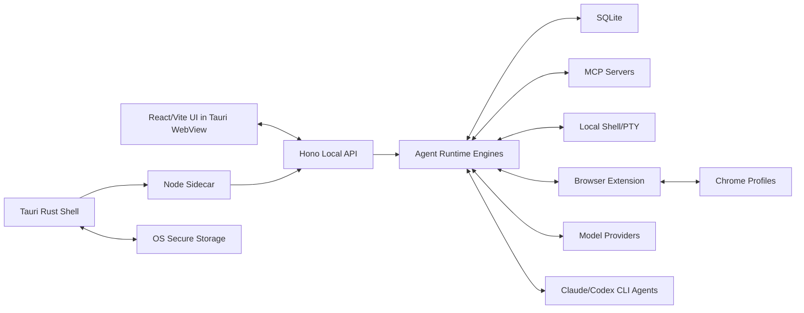

# Local Desktop Agent Run Loop Client

Status: working product/architecture baseline  
Scope: local-first desktop agent client, browser extension bridge, multi-provider model runtime, local tool execution

## 1. Product Intent

Build a local desktop AI agent run loop client. The product should let a user run agent workflows on their own computer, using local data, local tools, local browser profiles, local shell execution, and whichever model capability they already have access to.

The core product is not a cloud chatbot and not a thin wrapper around one model provider. It is a local agent runtime and control surface.

Primary value:

- Give users a reliable local agent loop that can use their machine, browser, files, shell, MCP servers, skills, and installed AI CLIs.
- Keep data and execution local by default.
- Let users switch model providers without redesigning the UI, database, or agent state model for every provider-specific feature.
- Support both API-based models and local subscription-based CLI tools such as Claude Code CLI and Codex CLI.

## 2. Target Users And Use Cases

Initial users:

- AI builders, indie builders, vibe coders, technical founders, and power users who already use AI coding/agent tools.
- Users who have multiple model accounts, API keys, browser profiles, local tools, or CLI subscriptions.
- Users who want local-first control instead of sending all context and operations through a cloud-only product.

Core scenarios:

- Run a local agent that can call tools, inspect files, use MCP servers, invoke skills, and stream responses back to the desktop UI.
- Switch between OpenAI, OpenAI-compatible providers, Anthropic, Google, Qwen, Kimi, MiniMax, GLM, small/local models, and routing providers.
- Use local CLI agents as model capability providers, for example `claude` or `codex`, while preserving timeout, cancellation, logs, cwd, and permission controls.
- Use a browser extension to operate inside a selected Chrome profile, including profile-aware click, scroll, page extraction, and browser state actions.
- Keep conversation history, runs, messages, tool calls, outputs, settings, and provider configuration on the user's machine.
- Optionally connect to future cloud services for long-running agents, sync, collaboration, or remote execution, without making cloud required for local workflows.

## 3. Product Principles

Production-first:

- Do not build demo-only flows as the main product path.
- The real desktop app, real sidecar, real DB, real browser bridge, real shell execution, and real provider flow are the product path.
- A web preview can help check UI quickly, but it is not the final product client.

Local-first:

- Local data stays local by default.
- Cloud features must be optional and clearly separated from local operation.
- Secrets are stored through OS secure storage, not plain text in SQLite.

Provider-neutral:

- The UI and database should not become a provider-specific feature encyclopedia.
- Provider-specific details may be stored as raw metadata, but the product surface should focus on a common agent event model.
- Strong provider features can be selectively enabled, but must not define the core architecture.

Capability-oriented:

- API models, OpenAI-compatible models, AI SDK providers, local models, and CLI agents are all ways to provide AI capability.
- The product should abstract them as backends/runtimes instead of treating every provider as a separate product mode.

Explicit execution control:

- Shell, browser, filesystem, MCP, and CLI-agent actions need permissions, timeouts, cancellation, audit logs, and visible results.
- Dangerous actions should support human approval.

## 4. Non-Goals And Boundaries

Do not optimize for provider-specific completeness:

- Do not adapt the UI and DB for every special provider feature such as unique reasoning blocks, cache token formats, citation formats, special thinking params, or custom media params.
- Store raw provider metadata when useful, but keep the first-class event model small.

Do not make CLI agents just a shell tool:

- Claude Code CLI and Codex CLI are AI capability backends.
- They need a dedicated `cli-agent` runtime because they stream, manage sessions, use cwd, run commands, and rely on local subscription/auth state.

Do not put persistent product data in the Tauri Rust layer:

- Rust/Tauri should manage native shell, lifecycle, updater, secure storage bridge, and native OS integration.
- Node sidecar should own agent runtime, local HTTP API, DB writes, tool orchestration, provider adapters, and event streaming.

Do not require cloud for the local product:

- Website, account, updates, remote runs, or long-running cloud agents can exist, but the local desktop client must remain usable independently where possible.

## 5. High-Level Architecture

Chosen baseline:

- Desktop shell: Tauri
- UI: React + Vite
- Runtime sidecar: Node.js
- Local API: Hono
- Database: SQLite owned by Node sidecar
- ORM/query layer: Drizzle or a thin typed SQL layer
- SQLite driver: likely `better-sqlite3`, with packaging/CI attention
- Secure storage: Tauri/Rust bridge to OS keychain/credential store
- Agent runtime: OpenAI Agents SDK as one runtime engine, not the entire provider abstraction
- Provider compatibility: OpenAI-compatible direct path first, AI SDK adapter as fallback/secondary path
- Website: Next.js, deployable on Vercel or Cloudflare
- Optional cloud runtime: Fly.io or similar, separate from local-first client

Runtime topology:



## 6. Technology Stack Decisions

### Tauri

Use Tauri instead of Electron.

Reasons:

- Electron would mainly provide a window and sidecar launcher, while still introducing another embedded Node runtime.
- The product already needs a dedicated Node sidecar for agent runtime, MCP, provider SDKs, CLI process handling, and DB access.
- Tauri keeps the desktop shell lighter and lets Rust handle OS-level integration, secure storage bridge, lifecycle, updater, native messaging registration, and process management.
- Tauri aligns better with local-first native desktop requirements without forcing the app into Electron's runtime model.

Tauri responsibilities:

- Start, monitor, and stop the Node sidecar.
- Provide native shell/window lifecycle.
- Handle app updates and packaging.
- Expose secure storage commands to the sidecar/UI where needed.
- Help install/register native messaging host for browser extension where appropriate.
- Avoid owning business persistence or agent orchestration.

### React + Vite

Use React + Vite for the desktop UI.

Reasons:

- Good Tauri fit.
- Fast local iteration.
- Suitable for rich agent UI: threads, run timelines, tool events, model selector, provider settings, browser profile controls, shell output, approvals.
- Can share design primitives with website or extension popup where useful.

### Node.js Sidecar

Use a dedicated Node sidecar as the product backend.

Reasons:

- Best ecosystem fit for OpenAI Agents SDK, OpenAI SDK, AI SDK providers, MCP TypeScript SDK, browser extension tooling, process streaming, and CLI orchestration.
- Keeps provider and agent logic out of Rust.
- Gives one stable runtime for API, DB, tools, and streaming.

Sidecar responsibilities:

- Hono local API server.
- Agent runtime engines.
- Provider registry and model configuration.
- Tool registry, MCP clients, skills, shell execution, browser bridge.
- SQLite persistence.
- Streaming events and cancellation.
- CLI agent process lifecycle.

### Hono

Use Hono as a thin local API boundary.

Reasons:

- UI, browser extension, and future automation flows all need a stable local API.
- Hono is small and works well for local HTTP, SSE, and WebSocket-style routing.
- It keeps API contracts testable without tying them directly to Tauri commands.
- Some routes may later be reused in a cloud runtime.

Expected local API:

- `GET /health`
- `GET /config`
- `POST /runs`
- `GET /runs/:id/events` via SSE
- `POST /runs/:id/cancel`
- `POST /tools/:id/approve`
- `GET /providers`
- `POST /providers/test`
- `GET /browser/profiles`
- `POST /browser/actions`
- `GET /mcp/servers`
- `POST /mcp/servers/:id/reload`

### SQLite

Use local SQLite as the primary data store.

Reasons:

- Local-first product.
- Good for conversations, runs, events, tool calls, provider configs, project data, local memories, and audit logs.
- Easy backup/export story.
- Works cross-platform with correct packaging.

Recommended ownership:

- Node sidecar owns SQLite reads/writes.
- Tauri/Rust should not directly write product DB.
- UI talks to the sidecar API, not DB directly.

`better-sqlite3` note:

- It is a native Node addon.
- Cross-platform packaging is manageable but requires explicit CI/build validation for macOS, Windows, and Linux.
- Use a fixed sidecar Node runtime/version to avoid ABI mismatch.
- Package native addon per platform and test installed app, not only dev mode.

Alternative:

- If `better-sqlite3` packaging becomes painful, evaluate `node:sqlite` when runtime support is sufficient, or use a Rust-managed SQLite bridge only if Node-native packaging becomes a real blocker.

### Secure Storage

Secrets should not be stored directly in SQLite.

Use OS secure storage through Tauri/Rust:

- macOS: Keychain
- Windows: Credential Manager or DPAPI-backed storage
- Linux: Secret Service where available, with a documented fallback such as Stronghold or encrypted local store

SQLite stores:

- Provider IDs
- Secret references
- Non-secret provider config
- Capability flags
- Last tested status

Secure storage stores:

- API keys
- OAuth refresh tokens
- Local bridge tokens
- Sensitive provider credentials

## 7. Communication Model

### UI To Sidecar

Use local HTTP plus streaming:

- UI calls Hono on `127.0.0.1:{port}`.
- Use short-lived local bearer token generated on startup or install.
- Use SSE for chat/run streaming because it is simple, observable, and fits one-way run event streams.
- Use WebSocket where bidirectional real-time control is useful, especially browser extension bridge and live event bus.

Main stream event shape:

```ts
type RunEvent =
  | { type: "run_started"; runId: string }
  | { type: "text_delta"; runId: string; messageId: string; delta: string }
  | { type: "tool_request"; runId: string; toolCallId: string; toolName: string; input: unknown }
  | { type: "tool_result"; runId: string; toolCallId: string; output: unknown }
  | { type: "approval_required"; runId: string; toolCallId: string; reason?: string }
  | { type: "usage"; runId: string; usage: unknown }
  | { type: "done"; runId: string }
  | { type: "error"; runId: string; error: string };
```

This event model should remain product-owned. Provider/SDK events are mapped into it.

### Browser Extension To Local App

Support both options where practical:

- Native Messaging for stronger local app identity and Chrome extension integration.
- WebSocket to sidecar for lower-latency bidirectional event flow.

The extension should support multiple Chrome profiles. The user should be able to choose which profile/session to operate in. This is one reason extension-based browser control is preferred over a single embedded browser automation process.

Extension-provided capabilities:

- Profile/session discovery.
- Page context extraction.
- Click, scroll, type, navigation, screenshots where allowed.
- DOM/context tools.
- Browser profile aware state.

The local app should treat browser actions as tools with permissions, logs, and approval policy.

## 8. Agent Runtime Strategy

The product abstraction is not OpenAI Agents SDK directly. The product abstraction is `AI Backend` plus `Runtime Engine`.

Recommended runtime engine enum:

```ts
type ProviderTransport =
  | "openai-responses"
  | "openai-chat-compatible"
  | "ai-sdk-adapter"
  | "custom-model"
  | "cli-agent";
```

Runtime selection:

- `openai-responses`: OpenAI official models and features that need Responses API.
- `openai-chat-compatible`: default for most OpenAI-compatible providers using `baseURL`.
- `ai-sdk-adapter`: fallback or special path when AI SDK provider is more reliable than direct compatibility.
- `custom-model`: special SDKs, OAuth providers, or custom protocols.
- `cli-agent`: local CLI agents such as Claude Code CLI and Codex CLI.

Tool mode enum:

```ts
type ToolMode = "auto" | "native" | "prompted" | "disabled";
```

Tool mode behavior:

- `native`: provider has reliable native tool calling.
- `prompted`: provider is weak or small model, use prompted JSON action protocol.
- `disabled`: pure chat or no reliable tool calling.
- `auto`: pick based on capability test and provider config.

## 9. OpenAI Agents SDK Decision

Use OpenAI Agents SDK for agent run loop where it fits.

It is valuable for:

- Multi-turn run loop.
- Tool execution loop.
- Handoffs and sub-agents.
- `agent.asTool()` composition.
- Guardrails.
- Tool approvals and interruption/resume patterns.
- Streaming and non-streaming parity.
- MCP integration.
- Shell/computer/apply_patch tool types.
- Session interface and run state concepts.

It should not own the whole product architecture:

- It should not define our DB schema.
- It should not define our UI event model.
- It should not force all providers through one compatibility path.
- It should not replace CLI agent runtime.
- It should not make us expose provider-specific complexity everywhere.

Revised position:

- Use OpenAI Agents SDK as the default `native tool calling` run loop engine.
- Do not use AI SDK adapter as the default compatibility layer.
- Use direct OpenAI-compatible Chat Completions `baseURL` first for most compatible providers.
- Keep AI SDK adapter as a secondary path when direct compatibility is worse or when an AI SDK provider is clearly better.

## 10. Provider Compatibility Strategy

Provider priority:

1. OpenAI official models: `openai-responses`
2. Most OpenAI-compatible providers: `openai-chat-compatible`
3. Providers with better AI SDK support than OpenAI-compatible support: `ai-sdk-adapter`
4. Special provider SDKs or OAuth flows: `custom-model`
5. Local subscription CLIs: `cli-agent`

OpenAI-compatible default:

- Use OpenAI SDK client with `baseURL`.
- Force Chat Completions mode for compatible providers unless they explicitly support Responses API.
- Disable or avoid Responses-only features such as `previousResponseId`, `conversationId`, tool search, deferred tool loading, hosted Responses tools.
- Use full local history from SQLite for Chat Completions.

Provider capability tests:

- Can stream text?
- Can call tools?
- Can return valid tool arguments?
- Can use parallel tool calls?
- Can handle long context?
- Does it support JSON schema or only text JSON?
- Does it support vision/files/audio?
- Does it accept OpenAI-compatible request fields strictly or loosely?

Common provider record:

```ts
type ProviderConfig = {
  id: string;
  name: string;
  transport: ProviderTransport;
  baseUrl?: string;
  model: string;
  secretRef?: string;
  toolMode: ToolMode;
  capabilities: {
    streaming: boolean;
    nativeToolCalling: boolean;
    jsonMode?: boolean;
    vision?: boolean;
    files?: boolean;
    maxContextTokens?: number;
  };
  providerOptions?: Record<string, unknown>;
};
```

Provider-specific options:

- Keep them in `providerOptions` or raw metadata.
- Do not promote them into first-class UI unless they are common and important.

## 11. CLI Agent Runtime

CLI agents are not regular shell tools.

Examples:

- Claude Code CLI
- Codex CLI
- Other local AI CLIs backed by subscriptions or local auth

Why dedicated runtime:

- They are long-running AI capability providers.
- They stream structured or semi-structured output.
- They may manage their own auth/session/subscription.
- They need cwd/workspace, env, stdin, stdout, stderr, process tree, timeout, cancellation, and logs.
- They may execute commands or modify files internally.

Required `cli-agent` features:

- Spawn process with configured command, args, cwd, env.
- Stream stdout/stderr into run events.
- Timeout and cancellation.
- Kill process tree cross-platform.
- Optional PTY mode.
- Capture exit code and signal.
- Persist raw logs and normalized events.
- Allow per-workspace permission policy.
- Detect auth/setup errors.
- Support user-provided executable path.

CLI agent should produce the same product-level events:

- `text_delta`
- `tool_request` if parseable
- `tool_result` if parseable
- `error`
- `done`
- raw log events as metadata

## 12. Shell Tool Runtime

Shell tool support is separate from CLI agent support.

Shell tool is for model-requested local commands inside a normal agent run loop.

Requirements:

- Command timeout.
- Max output size and truncation policy.
- cwd and workspace boundary.
- env allowlist.
- cancellation and process tree kill.
- stdout/stderr separation.
- exit code capture.
- audit log.
- approval policy for risky commands.
- cross-platform support for macOS, Windows, and Linux.

Shell tool output should be structured:

```ts
type ShellCommandResult = {
  command: string;
  cwd: string;
  stdout: string;
  stderr: string;
  exitCode: number | null;
  signal?: string;
  timedOut: boolean;
  durationMs: number;
  truncated: boolean;
};
```

## 13. MCP, Skills, And Tools

MCP:

- Support local stdio MCP servers.
- Support streamable HTTP/SSE MCP servers where useful.
- Maintain MCP server lifecycle in the Node sidecar.
- Cache tool list when configured.
- Allow per-server tool allowlist/denylist.
- Persist server config locally.
- Expose MCP tool calls as normal product tool events.

Skills:

- Skills are local reusable capability packages.
- Skills can define instructions, scripts, templates, or tool wrappers.
- The product should treat skills as user-installable/local resources, not just model prompts.
- Skills may integrate with shell, MCP, browser, filesystem, or provider-specific runtimes.

Tool calls:

- Use native model tool calls when reliable.
- Use prompted JSON action protocol for weak/small models.
- Always route actual execution through product-owned tool registry and permission layer.

Approvals:

- Some tool calls should pause and wait for user approval.
- Approval result should be persisted.
- Rejected calls should return model-visible rejection output.

## 14. Persistence Model

SQLite should store product state, not provider state only.

High-level tables:

- `projects`
- `threads`
- `runs`
- `messages`
- `run_events`
- `tool_calls`
- `tool_results`
- `providers`
- `models`
- `provider_capability_tests`
- `mcp_servers`
- `skills`
- `browser_profiles`
- `artifacts`
- `settings`
- `secret_refs`

Important rules:

- Store normalized product events first.
- Store raw provider events/metadata as optional JSON.
- Do not rely on provider-side conversation state as the only source of history.
- For Chat Completions compatibility, reconstruct request history from local DB.
- For OpenAI Responses, `previousResponseId` or server conversation state can be used as optimization, but local DB remains canonical.

## 15. Streaming Response

Streaming is required.

Recommended design:

- Agent runtime emits internal async events.
- Sidecar persists important events.
- Hono streams run events to UI using SSE.
- UI renders text deltas, tool calls, approvals, shell output, browser events, errors, and completion.

SSE is enough for primary chat streaming.

WebSocket remains useful for:

- Browser extension bridge.
- Bidirectional control.
- Live event subscriptions across multiple UI panels.
- Potential collaborative/cloud flows.

Do not change the whole architecture just for streaming. The sidecar can stream directly to the UI while still owning DB writes and event normalization.

## 16. Browser Extension Boundary

Browser control should be extension-based.

Reasons:

- User may have multiple Chrome profiles.
- Extension can operate in the user's real browser/profile context.
- User can choose which profile to use.
- It avoids forcing all browser tasks into one automation browser instance.

Required browser extension capabilities:

- Profile/session selection.
- Active tab/page context.
- DOM extraction.
- Screenshot where allowed.
- Click/scroll/type/navigation tools.
- State reporting and errors.
- Local app connection via Native Messaging or WebSocket.

Security:

- Browser tool actions should require explicit permission policies.
- Sensitive page data should not be uploaded to cloud unless user intentionally uses cloud provider/model.
- Tool logs should identify which profile/tab was used.

## 17. Cloud And Website

Website:

- Use Next.js.
- Deploy on Vercel or Cloudflare.
- Website can handle marketing, docs, downloads, account, billing, and cloud feature entry points.

Cloud runtime:

- Optional future direction.
- Fly.io is a reasonable candidate for long-running agents or remote workers.
- Cloud agent runtime must not be required for local-first workflows.

Cloud features should be explicitly separated:

- Local run
- Cloud run
- Hybrid run

This avoids confusing data boundaries and trust expectations.

## 18. Cross-Platform Packaging

Target platforms:

- macOS
- Windows
- Linux

Known complexity:

- Node sidecar packaging.
- `better-sqlite3` native addon packaging.
- Shell process tree cancellation differs by OS.
- PTY support differs by OS.
- OS secure storage behavior differs by OS.
- Browser native messaging registration differs by OS and browser.

Required packaging discipline:

- Fixed sidecar Node runtime.
- Per-platform CI build.
- Per-platform smoke tests on installed app.
- Verify DB open/migration.
- Verify secure storage read/write.
- Verify provider test call.
- Verify shell timeout and cancellation.
- Verify browser extension bridge.
- Verify native messaging registration.

## 19. Security Requirements

Local API:

- Bind to `127.0.0.1`, not public interfaces.
- Use random local bearer token.
- Restrict CORS.
- Rotate token on reinstall or reset.
- Avoid exposing unauthenticated tool execution endpoints.

Secrets:

- Store secrets in OS secure storage.
- SQLite stores secret references, not raw keys.
- Never log API keys or OAuth tokens.

Tools:

- Permission policy for shell, filesystem, browser, network, MCP, and CLI agents.
- Approval flow for high-risk commands.
- Timeout and cancellation.
- Audit logs for executed actions.
- Output truncation to avoid DB/UI overload.

Provider calls:

- User should understand when local context is sent to a remote provider.
- Provider config should show whether a backend is local, remote API, or CLI/subscription based.

## 20. Business And Product Positioning

The product is best positioned as a local-first AI agent workbench for builders and power users, not as a generic chatbot.

Differentiation:

- Local execution and local data.
- Multi-provider and CLI-agent capability routing.
- Browser profile aware automation.
- Skills/MCP/tool execution under one run loop.
- User-controlled provider choice.
- Practical desktop integration rather than cloud-only abstraction.

Potential willingness-to-pay drivers:

- Users already pay for multiple model products or subscriptions.
- Users want to reuse their local subscriptions through CLI agents.
- Users need real browser/profile context.
- Users want local data control.
- Users need repeatable agent workflows across tools.

Risks:

- Broad provider compatibility can become a maintenance trap.
- Too much provider-specific UI can dilute the product.
- Shell/browser execution creates security and trust burden.
- Cross-platform packaging is non-trivial.
- If the product only replicates what users can do in Claude/Codex directly, value is weak.

Product response to risks:

- Keep a low-common-denominator event model.
- Support provider-specific features as raw metadata or advanced settings only.
- Make CLI agents a first-class backend because that leverages user subscriptions rather than competing with them.
- Focus on local tool/browser/workspace orchestration as the product's durable value.

## 21. Open Questions And Validation Items

Provider validation:

- Test OpenAI-compatible Chat Completions with key providers: OpenRouter, Qwen, Kimi, MiniMax, GLM, local Ollama/LM Studio.
- Check streaming compatibility.
- Check native tool call compatibility.
- Check JSON schema behavior.
- Check model-specific request field rejection.

AI SDK adapter validation:

- Identify providers where AI SDK is more reliable than direct OpenAI-compatible mode.
- Verify whether adapter adds unexpected limitations or event conversion issues.
- Keep it as fallback unless evidence shows it should be default for a provider class.

Packaging validation:

- Confirm `better-sqlite3` packaging across macOS/Windows/Linux with fixed sidecar Node.
- Verify installed app behavior, not only dev mode.

Secure storage validation:

- Confirm Tauri secure storage/keychain plugin behavior across macOS/Windows/Linux.
- Define Linux fallback when Secret Service is unavailable.

Browser validation:

- Decide Native Messaging vs WebSocket default.
- Verify multi-profile extension routing.
- Verify extension install/update/native host registration flow.

CLI validation:

- Validate Claude Code CLI and Codex CLI process behavior.
- Confirm streaming, timeout, cancellation, cwd, and auth failure detection.

## 22. Current Baseline Decision Summary

Use this as the current baseline unless later evidence changes it:

- Desktop: Tauri.
- UI: React + Vite.
- Runtime: Node sidecar.
- Local API: Hono.
- DB: SQLite in Node sidecar.
- SQLite driver: likely `better-sqlite3`, validate packaging early.
- Secrets: Tauri/Rust bridge to OS secure storage.
- Agent run loop: OpenAI Agents SDK for native-tool-capable providers.
- Provider default: direct OpenAI-compatible Chat Completions via `baseURL`.
- AI SDK: secondary compatibility layer, not default.
- CLI agents: dedicated `cli-agent` runtime.
- Browser: extension-based bridge with multi-profile support.
- Streaming: sidecar emits product-owned events over SSE/WebSocket.
- Cloud: optional future layer, not required for local-first product.
