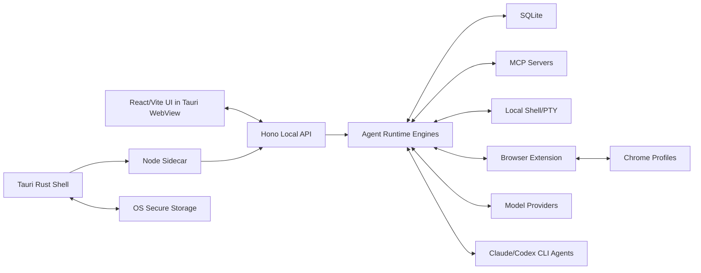

# 本地桌面 Agent Run Loop 客户端

状态：当前产品与架构基线  
范围：本地优先桌面 Agent 客户端、浏览器插件桥、多模型 Provider Runtime、本地工具执行

## 1. 项目定位

我们要做的是一个运行在用户电脑端的本地桌面 Agent Run Loop 客户端。

它不是一个云端聊天机器人，也不是某一个模型 Provider 的简单套壳。它的核心价值是：在用户自己的电脑上，组织模型、工具、浏览器、Shell、MCP、Skills、本地数据和 CLI Agent，让用户可以把各种 AI 能力统一放进一个可控、可持久化、可审计的本地 Agent Runtime。

核心方向：

- 数据和执行默认在用户本地。
- 用户可以切换不同模型 Provider。
- 支持本地工具调用，包括 Shell、MCP、Skills、浏览器插件、文件系统等。
- 支持 Claude Code CLI、Codex CLI 这类本地订阅型 CLI Agent，把它们作为 AI 能力来源。
- 不把 UI、数据库和事件模型绑死在某一个 Provider 的特殊能力上。
- 未来可以扩展云端长运行 Agent，但本地能力不是云端能力的附属品。

## 2. 目标用户和核心场景

初始目标用户：

- AI Builder、独立开发者、vibe coder、技术创始人、重度 AI 工具用户。
- 已经同时使用多个模型、多个 API Key、多个浏览器 Profile、多个本地工具或 CLI 订阅的用户。
- 希望 Agent 可以真的使用自己电脑、本地浏览器、本地文件和本地环境的用户。
- 对数据留在本地、执行可控、工具调用可见有需求的用户。

核心场景：

- 用户在桌面客户端里发起一个 Agent Run。
- Agent 可以流式返回文本。
- Agent 可以调用 MCP、Skills、Shell、浏览器插件、本地文件工具。
- 用户可以在不同模型之间切换，例如 OpenAI、Anthropic、Google、Qwen、Kimi、MiniMax、GLM、小模型、本地模型、OpenRouter 等。
- 用户可以使用本地已登录或已订阅的 Claude Code CLI / Codex CLI 来获得模型能力。
- 用户可以让浏览器插件在指定 Chrome Profile 里执行点击、滚动、提取页面上下文等操作。
- 会话、Run、消息、工具调用、工具结果、Provider 配置、浏览器 Profile 信息等都持久化在本地。

## 3. 产品原则

### 本地优先

- 本地数据默认留在本地。
- 本地 Agent 不依赖云端服务才能工作。
- 云端能力可以存在，但必须是可选层。
- 用户应该清楚什么时候数据会发给远程 Provider。

### 生产级优先

- 不以 demo、MVP、临时方案作为主路径。
- Tauri 桌面端、Node Sidecar、SQLite、本地 API、Shell 执行、浏览器插件桥、Provider 调用都必须按真实产品路径设计。
- Web Preview 只能辅助 UI 检查，不能替代真实桌面客户端路径。

### Provider 中立

- 不为每个模型 Provider 的特殊功能都改 UI 和 DB。
- Provider 特有能力可以作为高级配置或 raw metadata 存储。
- 第一优先级是稳定、统一的 Agent 事件模型。
- 产品不追求完整复刻每家模型的所有细节。

### 能力抽象

API 模型、本地模型、OpenAI-compatible 模型、AI SDK Provider、Claude Code CLI、Codex CLI，本质上都是不同的 AI 能力来源。

产品应该抽象为：

- Provider / Backend
- Runtime Engine
- Tool Mode
- Capability Test
- Event Mapping

而不是把每家 Provider 做成独立产品形态。

### 执行可控

Shell、浏览器、文件系统、MCP、CLI Agent 都涉及真实执行能力。

必须支持：

- 权限策略
- 超时
- 取消
- 审批
- 日志
- 可见结果
- 风险动作的人类确认

## 4. 非目标和边界

### 不追求 Provider 特性百科全书

不优先适配这些内容为一等 UI / DB 字段：

- 特殊 reasoning block
- cache token 明细
- citation 细节
- thinking 参数
- 各家自定义媒体参数
- 特殊响应结构

这些内容可以进入 `providerData` 或 raw metadata，但不应该污染核心事件模型。

### 不把 CLI Agent 当成普通 Shell Tool

Claude Code CLI、Codex CLI 不是普通 Shell 命令工具。

它们是 AI 能力后端，因为它们：

- 自己管理登录态或订阅态
- 会流式输出
- 有自己的上下文和会话
- 可能执行命令或修改文件
- 需要 cwd、env、stdin、stdout、stderr、timeout、取消和进程树管理

所以需要专门的 `cli-agent` Runtime，而不是简单塞进 Shell Tool。

### 不让 Rust/Tauri 管业务持久化

Tauri/Rust 负责：

- 桌面壳
- 窗口生命周期
- 启动和管理 Node Sidecar
- Updater
- OS Secure Storage Bridge
- Native Messaging Host 注册辅助
- 原生系统集成

不负责：

- Agent Run Loop
- Provider SDK
- MCP 客户端
- 业务 DB 写入
- Tool 编排
- 事件持久化

业务 Runtime 和 DB 由 Node Sidecar 负责。

### 不强依赖云端

官网、账号、下载、更新、云端长运行 Agent 都可以有，但本地桌面客户端不能变成云服务的附属入口。

## 5. 总体架构

当前基线技术栈：

- 桌面壳：Tauri
- UI：React + Vite
- 本地后端：Node.js Sidecar
- 本地 API：Hono
- 数据库：SQLite
- SQLite 访问：优先考虑 `better-sqlite3`，但需要早期验证跨平台打包
- 安全存储：Tauri/Rust 桥接 OS Keychain / Credential Store
- Agent Runtime：OpenAI Agents SDK 作为 Runtime Engine 之一
- Provider 兼容：优先 OpenAI-compatible Chat Completions `baseURL`
- AI SDK：作为二级兼容层，不作为默认层
- 浏览器控制：浏览器插件 + Native Messaging 或 WebSocket
- 官网：Next.js，可部署 Vercel 或 Cloudflare
- 可选云端 Runtime：Fly.io 等长运行环境

架构关系：



## 6. 技术栈决策

### Tauri

选择 Tauri，而不是 Electron。

原因：

- Electron 主要提供窗口和 Sidecar 启动能力，但会引入另一个 Node Runtime。
- 我们本来就需要独立 Node Sidecar 来跑 Agent Runtime、MCP、Provider SDK、DB、Shell 和 CLI Agent。
- 用 Electron 会变成 Electron 自带 Node + Sidecar Node 两套 Node，复杂度不低。
- Tauri 更适合做轻量桌面壳、生命周期、Updater、OS Secure Storage 和 Native Messaging 注册。
- Rust 层做原生系统能力，Node 层做业务 Runtime，边界更清晰。

Tauri 负责：

- 启动和监控 Node Sidecar
- 桌面窗口生命周期
- App 更新
- 系统安全存储桥
- Native Messaging Host 注册辅助
- 原生菜单、托盘、文件权限等系统集成

Tauri 不负责：

- Agent 编排
- Provider 调用
- DB 业务写入
- MCP 工具执行
- Run Event 持久化

### React + Vite

React + Vite 用于桌面 UI。

适合承载：

- 会话列表
- Run Timeline
- Streaming Text
- Tool Call / Tool Result
- Shell Output
- Browser Action
- Approval UI
- Provider Selector
- MCP / Skills 配置
- 本地设置页

### Node Sidecar

Node Sidecar 是本地核心后端。

选择 Node 的原因：

- OpenAI Agents SDK 是 TS/JS 生态。
- OpenAI SDK、AI SDK Provider、MCP TS SDK、浏览器插件相关工具链都更适合 Node。
- Shell streaming、CLI Agent、Hono、本地 API、SQLite 访问都可以集中在一个 Sidecar Runtime。

Sidecar 负责：

- Hono API
- Agent Runtime Engines
- Provider Registry
- Tool Registry
- MCP Client
- Skills Runtime
- Shell / PTY 执行
- CLI Agent 执行
- Browser Extension Bridge
- SQLite 持久化
- SSE / WebSocket 事件流

### Hono

Hono 是推荐的本地 API 层。

它不是绝对必须，但在当前需求下更优。

原因：

- UI 需要请求本地 API。
- Streaming 需要稳定的 SSE 路由。
- 浏览器插件需要和本地程序通信。
- Provider 测试、MCP 管理、Run 管理、Tool Approval 都需要 API 边界。
- Hono 足够轻，不会引入过大框架负担。
- 未来部分 API 逻辑可能迁移到云端 Runtime，Hono 的边界更容易复用。

典型 API：

- `GET /health`
- `GET /config`
- `POST /runs`
- `GET /runs/:id/events`
- `POST /runs/:id/cancel`
- `POST /tools/:id/approve`
- `GET /providers`
- `POST /providers/test`
- `GET /browser/profiles`
- `POST /browser/actions`
- `GET /mcp/servers`
- `POST /mcp/servers/:id/reload`

### SQLite

SQLite 是本地持久化主存储。

适合存：

- Projects
- Threads
- Runs
- Messages
- Run Events
- Tool Calls
- Tool Results
- Provider Configs
- MCP Servers
- Skills
- Browser Profiles
- Artifacts
- Settings
- Secret References

原则：

- Node Sidecar 拥有 DB 读写。
- UI 不直接访问 DB。
- Tauri/Rust 不直接写业务 DB。
- 本地 DB 是 Canonical State。
- Provider 侧 conversation state 只能作为优化，不能作为唯一历史。

`better-sqlite3` 判断：

- 它是 native Node addon。
- macOS / Windows / Linux 打包会有额外复杂度。
- 但只要固定 Sidecar Node 版本，并做 per-platform CI，属于可管理复杂度。
- 需要尽早做真实安装包验证，不只跑 dev mode。

备选：

- 如果 `better-sqlite3` 打包成本明显过高，再评估 `node:sqlite` 或 Rust SQLite Bridge。
- 但在当前阶段，仍倾向 Node Sidecar 直接持有 SQLite。

### Secure Storage

API Key 和 OAuth Token 不直接存 SQLite。

安全存储方案：

- macOS：Keychain
- Windows：Credential Manager 或 DPAPI
- Linux：Secret Service，必要时使用 Stronghold 或加密本地 fallback

SQLite 存：

- `providerId`
- `secretRef`
- 非敏感配置
- capability flags
- last tested status

OS Secure Storage 存：

- API Key
- OAuth Refresh Token
- Local Bridge Token
- 其他敏感凭证

## 7. 通信模型

### UI 和 Sidecar

UI 通过本地 HTTP 访问 Node Sidecar：

- 地址绑定 `127.0.0.1:{port}`
- 使用启动时生成的本地 Bearer Token
- 限制 CORS
- 不暴露未鉴权的工具执行 API

Streaming：

- 主 Chat / Run Streaming 使用 SSE。
- Tool Event、Text Delta、Approval、Error、Done 都通过产品自己的事件模型发送。
- WebSocket 用于需要双向实时通信的场景，例如浏览器插件桥和全局事件总线。

产品级 Run Event：

```ts
type RunEvent =
  | { type: "run_started"; runId: string }
  | { type: "text_delta"; runId: string; messageId: string; delta: string }
  | { type: "tool_request"; runId: string; toolCallId: string; toolName: string; input: unknown }
  | { type: "tool_result"; runId: string; toolCallId: string; output: unknown }
  | { type: "approval_required"; runId: string; toolCallId: string; reason?: string }
  | { type: "usage"; runId: string; usage: unknown }
  | { type: "done"; runId: string }
  | { type: "error"; runId: string; error: string };
```

原则：

- SDK / Provider 原始事件需要映射到产品事件。
- UI 不直接依赖某个 Provider 的原始事件结构。
- DB 先存产品事件，再附带 raw metadata。

### 浏览器插件和本地程序

浏览器插件是浏览器控制的主方案。

通信方式：

- Native Messaging：更强的本地 App 身份和浏览器扩展集成。
- WebSocket：更适合低延迟双向事件流。

可以两者并存：

- Native Messaging 用于建立可信通道、唤起本地程序、注册 Host。
- WebSocket 用于实时操作和事件流。

浏览器插件能力：

- 识别/选择 Chrome Profile
- 读取当前页面上下文
- DOM 提取
- 点击
- 滚动
- 输入
- 导航
- 截图
- Tab 状态
- 页面错误状态

浏览器工具调用也必须进入权限、审批、日志和审计体系。

## 8. Agent Runtime 策略

产品抽象不是直接等于 OpenAI Agents SDK。

产品抽象应该是：

- AI Backend
- Provider Transport
- Runtime Engine
- Tool Mode
- Capability Test
- Event Mapping

Provider Transport：

```ts
type ProviderTransport =
  | "openai-responses"
  | "openai-chat-compatible"
  | "ai-sdk-adapter"
  | "custom-model"
  | "cli-agent";
```

含义：

- `openai-responses`：OpenAI 官方模型和 Responses API 能力。
- `openai-chat-compatible`：大多数 OpenAI-compatible Provider 的默认路径。
- `ai-sdk-adapter`：当 AI SDK Provider 比直接 OpenAI-compatible 更稳定时使用。
- `custom-model`：特殊 SDK、OAuth、非标准协议。
- `cli-agent`：Claude Code CLI、Codex CLI 等本地 CLI Agent。

Tool Mode：

```ts
type ToolMode = "auto" | "native" | "prompted" | "disabled";
```

含义：

- `native`：Provider 有可靠原生 Tool Calling。
- `prompted`：模型较弱或 Tool Calling 不稳定，使用 Prompted JSON Action Protocol。
- `disabled`：纯聊天，不启用工具。
- `auto`：根据 Provider Capability Test 决定。

## 9. OpenAI Agents SDK 决策

OpenAI Agents SDK 值得使用，但不是整个产品架构的中心。

它适合承担：

- Agent Run Loop
- 多轮模型调用
- Tool Call / Tool Result Loop
- Handoff
- Agent as Tool
- Guardrails
- Tool Approval
- Interruption / Resume
- Streaming / Non-streaming 对齐
- MCP 集成
- Shell / Computer / Apply Patch 等工具类型抽象
- Session / RunState 概念

它不应该承担：

- 产品 DB Schema
- UI Event Model
- Provider Registry 的全部设计
- CLI Agent Runtime
- 产品权限系统的全部边界
- 每家模型 Provider 的特殊能力适配

当前判断：

- OpenAI Agents SDK 可以作为 native tool calling 能力强的 Provider 的默认 Run Loop Engine。
- 不能让 AI SDK adapter 成为所有模型的默认兼容层。
- 大多数 OpenAI-compatible Provider 应先走 `openai-chat-compatible`。
- AI SDK adapter 作为第二兼容路径保留。

## 10. Provider 兼容策略

推荐优先级：

1. OpenAI 官方模型：`openai-responses`
2. 大多数 OpenAI-compatible Provider：`openai-chat-compatible`
3. 直接兼容差但 AI SDK 更稳定的 Provider：`ai-sdk-adapter`
4. 特殊 OAuth / 特殊 SDK / 特殊协议：`custom-model`
5. 本地订阅型 CLI：`cli-agent`

### OpenAI-compatible 默认路径

对大多数国产模型、本地模型、OpenRouter、Ollama、LM Studio 等，优先使用：

- OpenAI SDK Client
- `baseURL`
- Chat Completions
- `useResponses: false`

原因：

- 市面上大多数所谓 OpenAI-compatible 实际兼容的是 `/v1/chat/completions`。
- 不一定支持 `/v1/responses`。
- 不一定支持 OpenAI Responses 的 server-side state、tool search、deferred tool loading 等能力。
- 直接走 Chat Completions 少一层 AI SDK 转换，问题更可控。

限制：

- 不使用 Responses-only 功能。
- 不依赖 `previousResponseId` / `conversationId` 作为唯一历史。
- 从本地 SQLite 重建完整 Chat History。
- Tool Calling 要做 Capability Test。

### AI SDK Adapter 使用场景

AI SDK adapter 不是默认层。

仅在这些情况下使用：

- 某 Provider 的 AI SDK Provider 比 OpenAI-compatible 更稳定。
- 需要 Anthropic / Google / OpenRouter 等成熟 AI SDK 生态包装。
- 需要 AI SDK UI stream protocol。
- 直接 OpenAI-compatible 字段兼容问题太多。

风险：

- 多一层转换：Agents SDK request -> AI SDK request -> Provider -> AI SDK result -> Agents SDK output。
- Adapter 自身是兼容层，可能带来意料之外的映射问题。
- 某些 Responses-only 功能不支持。
- 小 Provider 仍然需要逐个验证。

### Capability Test

每个 Provider / Model 应测试：

- 是否支持 streaming
- 是否支持 native tool calling
- tool arguments 是否稳定
- 是否支持 JSON Schema
- 是否支持 vision
- 是否支持 files
- 是否支持 parallel tool calls
- 是否严格拒绝未知字段
- 最大上下文
- 错误格式
- Rate limit / retry 行为

Provider 配置建议：

```ts
type ProviderConfig = {
  id: string;
  name: string;
  transport: ProviderTransport;
  baseUrl?: string;
  model: string;
  secretRef?: string;
  toolMode: ToolMode;
  capabilities: {
    streaming: boolean;
    nativeToolCalling: boolean;
    jsonMode?: boolean;
    vision?: boolean;
    files?: boolean;
    maxContextTokens?: number;
  };
  providerOptions?: Record<string, unknown>;
};
```

## 11. CLI Agent Runtime

CLI Agent 是独立 Runtime。

典型目标：

- Claude Code CLI
- Codex CLI
- 其他使用用户本地登录态或订阅能力的 CLI Agent

为什么独立：

- 它们不是一次性 Shell 命令。
- 它们自己就是 Agent。
- 它们可能会执行命令、读写文件、维护会话、流式输出。
- 它们依赖用户本地 Auth / Subscription。
- 它们需要更强的进程生命周期管理。

必须支持：

- command / args 配置
- cwd
- env
- stdin
- stdout streaming
- stderr streaming
- timeout
- cancel
- kill process tree
- exit code
- signal
- raw log 持久化
- optional PTY
- auth/setup error 检测
- per-workspace permission policy

CLI Agent 输出也应映射到产品事件：

- `text_delta`
- `tool_request`
- `tool_result`
- `error`
- `done`
- raw log metadata

## 12. Shell Tool Runtime

Shell Tool 和 CLI Agent 是两件事。

Shell Tool 是普通 Agent Run Loop 中模型请求执行本地命令的工具。

Shell Tool 必须支持：

- 命令超时
- 输出大小限制
- 输出截断
- cwd
- env allowlist
- 取消
- kill process tree
- stdout / stderr 分离
- exit code
- duration
- audit log
- 风险命令审批
- macOS / Windows / Linux 跨平台

结构化结果：

```ts
type ShellCommandResult = {
  command: string;
  cwd: string;
  stdout: string;
  stderr: string;
  exitCode: number | null;
  signal?: string;
  timedOut: boolean;
  durationMs: number;
  truncated: boolean;
};
```

## 13. MCP、Skills 和 Tools

### MCP

需要支持：

- 本地 stdio MCP server
- Streamable HTTP / SSE MCP server
- MCP server 生命周期管理
- Tool list cache
- Tool allowlist / denylist
- MCP config 本地持久化
- MCP tool call 映射为产品 Tool Event

### Skills

Skills 是本地可复用能力包，不只是 prompt。

可能包含：

- instructions
- scripts
- templates
- tool wrappers
- MCP 配置
- shell 能力
- browser 能力
- filesystem 能力

Skills 应作为本地资源管理，可以安装、启用、禁用、更新和参与 Tool Registry。

### Tool Calls

策略：

- Provider native tool calling 可靠时使用 native。
- 小模型或 weak provider 使用 prompted JSON action protocol。
- 实际执行永远通过产品 Tool Registry 和权限层。
- Tool Result 要持久化。
- Tool Error 要可见。

### Approval

需要支持：

- tool call 暂停等待用户确认
- 用户 approve / reject
- 审批结果持久化
- reject 后返回 model-visible rejection output
- 可配置哪些工具必须审批

## 14. 持久化模型

SQLite 存产品状态。

建议表：

- `projects`
- `threads`
- `runs`
- `messages`
- `run_events`
- `tool_calls`
- `tool_results`
- `providers`
- `models`
- `provider_capability_tests`
- `mcp_servers`
- `skills`
- `browser_profiles`
- `artifacts`
- `settings`
- `secret_refs`

原则：

- 产品事件是第一层。
- Provider raw metadata 是第二层。
- 本地 DB 是会话历史的可信来源。
- 对 Chat Completions Provider，从 DB 重建上下文。
- 对 OpenAI Responses，可使用 `previousResponseId` 或 server conversation 作为优化，但不能替代本地历史。
- Secret 只存引用，不存明文。

## 15. Streaming

Streaming 是必需能力。

推荐设计：

- Runtime 内部产生 async events。
- Sidecar 负责事件持久化和映射。
- Hono 通过 SSE 把 Run Events 推给 UI。
- UI 渲染文本增量、工具调用、工具结果、审批、Shell 输出、浏览器事件、错误和完成状态。

不需要为了 Streaming 改架构。

Sidecar 可以直接返回 streaming，同时仍然负责：

- DB 持久化
- Event normalization
- Tool execution
- Approval
- Cancellation

SSE 用于主 Run Stream。

WebSocket 用于：

- 浏览器插件桥
- 双向控制
- 多 UI 面板实时事件订阅
- 未来云端/协作场景

## 16. 浏览器插件边界

浏览器控制优先使用插件方案。

原因：

- 用户可能有多个 Chrome Profile。
- 插件可以运行在用户真实浏览器上下文。
- 用户可以选择在哪个 Profile 执行。
- 比单独启动一个自动化浏览器更符合真实使用场景。

插件能力：

- Profile / session 选择
- 当前 tab 状态
- 页面上下文提取
- DOM 提取
- click
- scroll
- type
- navigate
- screenshot
- error reporting

安全要求：

- 浏览器工具调用走权限策略。
- 日志记录 profile / tab 信息。
- 敏感页面数据不应默认上传云端。
- 用户选择远程 Provider 时，需要明确数据会发出本机。

## 17. 官网和云端

官网：

- Next.js。
- 可部署 Vercel 或 Cloudflare。
- 用于介绍、下载、文档、账号、价格、云功能入口。

云端 Runtime：

- 未来可选。
- Fly.io 可作为长运行 Agent 或远程 worker 的候选。
- 不应成为本地功能的必要依赖。

产品需要明确区分：

- Local Run
- Cloud Run
- Hybrid Run

## 18. 跨平台打包

目标平台：

- macOS
- Windows
- Linux

主要复杂点：

- Node Sidecar 打包。
- `better-sqlite3` native addon。
- Shell process tree kill 各平台不同。
- PTY 跨平台差异。
- OS Secure Storage 差异。
- Browser Native Messaging 注册差异。

必须尽早验证：

- 安装包启动。
- Sidecar 启动。
- DB 打开和 migration。
- Secure Storage read/write。
- Provider test call。
- Shell timeout / cancel。
- CLI Agent spawn / cancel。
- Browser Extension bridge。
- Native Messaging 注册。

## 19. 安全要求

本地 API：

- 只绑定 `127.0.0.1`。
- 使用随机本地 Bearer Token。
- 限制 CORS。
- 不提供未鉴权工具执行端点。
- Token 可 reset / rotate。

Secrets：

- API Key / OAuth Token 不写入 SQLite 明文。
- SQLite 只存 secret reference。
- 日志不得输出 secret。

Tools：

- Shell、browser、filesystem、MCP、CLI Agent 都需要权限策略。
- 高风险动作需要 approval。
- 所有执行有 audit log。
- 输出需要截断策略。
- 支持取消和超时。

Provider：

- 明确展示 Provider 是 local、remote API，还是 CLI subscription。
- 用户应理解什么时候上下文会发送给远程模型。

## 20. 业务定位

产品不应定位成普通 ChatGPT/Claude 替代品。

更准确定位：

本地优先的 AI Agent Workbench，用于把用户已有的模型能力、本地工具、本地浏览器、本地文件系统和 CLI Agent 统一成一个可控的桌面 Agent Runtime。

差异化：

- 本地数据和本地执行。
- 多 Provider / 多 Runtime。
- CLI Agent 一等支持。
- 浏览器多 Profile 控制。
- MCP / Skills / Tools 一体化。
- 可审计、可审批的本地执行。

潜在付费驱动力：

- 用户已经为多个模型或 CLI 工具付费。
- 用户想复用自己的订阅能力。
- 用户需要真实浏览器 Profile 上下文。
- 用户需要本地数据控制。
- 用户需要跨工具的可重复 Agent Workflow。

风险：

- Provider 兼容容易变成维护黑洞。
- 太多 Provider 特性会污染产品。
- Shell / Browser 执行带来安全信任压力。
- 跨平台打包成本高。
- 如果只复制 Claude/Codex 里 10 分钟能完成的事，价值不够强。

应对：

- 保持低公共分母事件模型。
- Provider 特性默认收敛到 metadata。
- CLI Agent 作为能力来源，而不是竞争对象。
- 产品重点放在本地工具、浏览器、工作区和 Agent Loop 编排。

## 21. 待验证项

Provider：

- OpenRouter
- Qwen
- Kimi
- MiniMax
- GLM
- Ollama
- LM Studio
- Anthropic
- Google

每个要验证：

- streaming
- tool calling
- JSON schema
- 字段兼容
- 错误格式
- retry 行为

AI SDK Adapter：

- 哪些 Provider 走 AI SDK 明显更稳。
- Adapter 是否引入额外转换问题。
- 是否影响 Streaming / Tool Event 映射。

Packaging：

- `better-sqlite3` 跨平台打包。
- Sidecar Node 固定版本。
- 安装包真实验证。

Secure Storage：

- macOS Keychain。
- Windows Credential Manager / DPAPI。
- Linux Secret Service fallback。

Browser：

- Native Messaging 和 WebSocket 的默认组合。
- 多 Chrome Profile 识别和切换。
- 插件安装、升级、Native Host 注册。

CLI Agent：

- Claude Code CLI。
- Codex CLI。
- streaming。
- timeout。
- cancel。
- cwd。
- auth failure detection。

## 22. 当前基线总结

当前默认决策：

- 桌面：Tauri。
- UI：React + Vite。
- Runtime：Node Sidecar。
- 本地 API：Hono。
- DB：SQLite，由 Node Sidecar 管。
- SQLite Driver：优先 `better-sqlite3`，早期验证打包。
- Secrets：Tauri/Rust 桥接 OS Secure Storage。
- Agent Run Loop：OpenAI Agents SDK 用于 native-tool-capable Provider。
- Provider 默认兼容：OpenAI-compatible Chat Completions `baseURL`。
- AI SDK：第二兼容层，不是默认层。
- CLI Agent：独立 `cli-agent` Runtime。
- Browser：浏览器插件，多 Profile 支持。
- Streaming：Sidecar 通过 SSE / WebSocket 输出产品级事件。
- Cloud：未来可选，不是本地客户端前置依赖。
